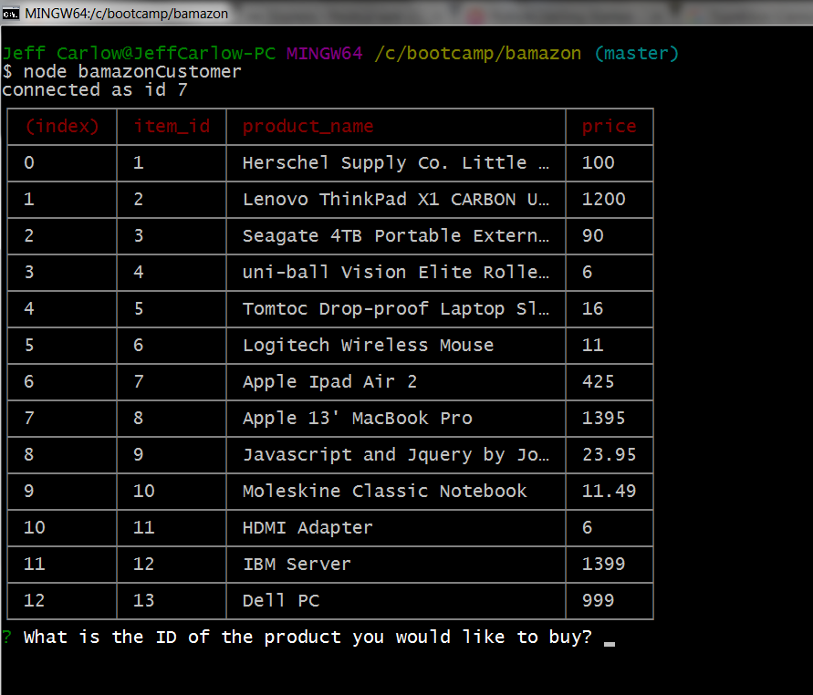
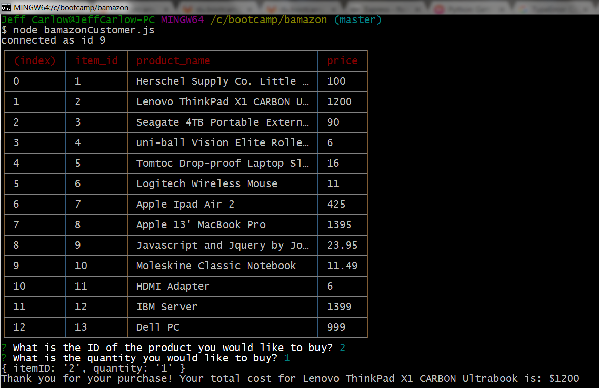
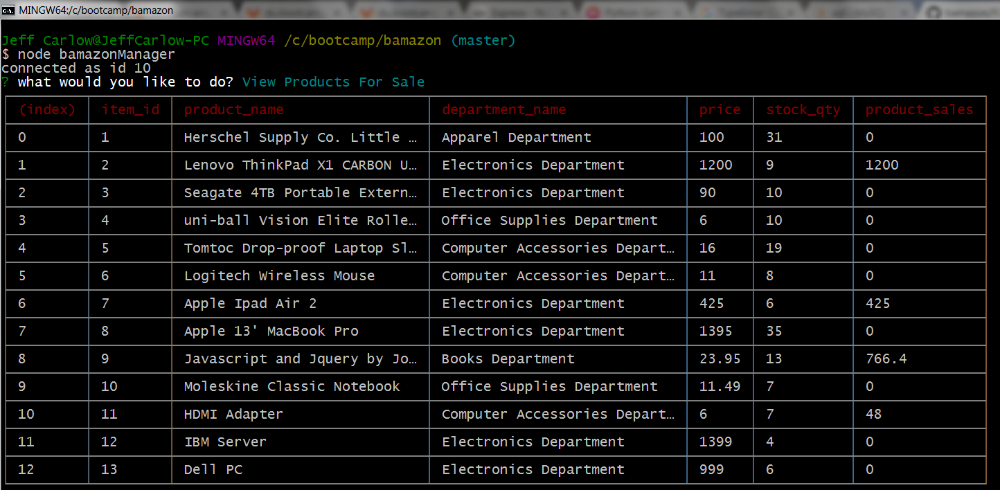
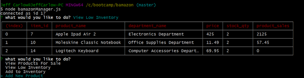

# bamazon
Amazon-like mysql database app. This uses node.js to create a dynamic mysql datbase which creates and manages a storefront.

## Instructions for use of application

1.) open git terminal and navigate to the folder of the app. In the command line enter `node bamazonCustomer.js` . This will populate a table with all of the items available for sale.

