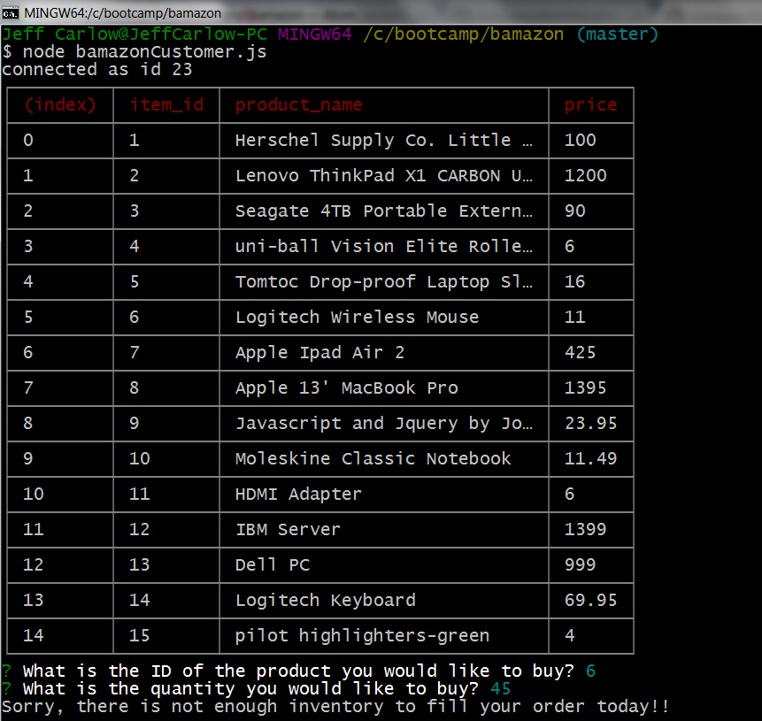
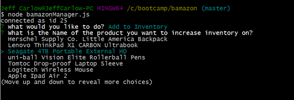
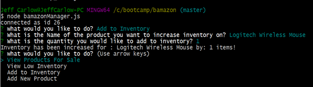
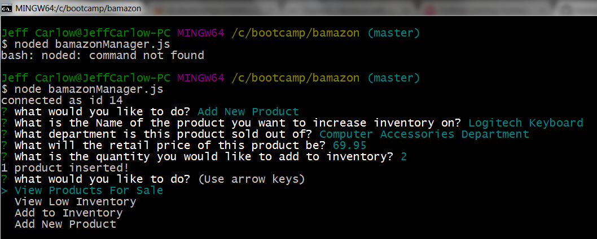
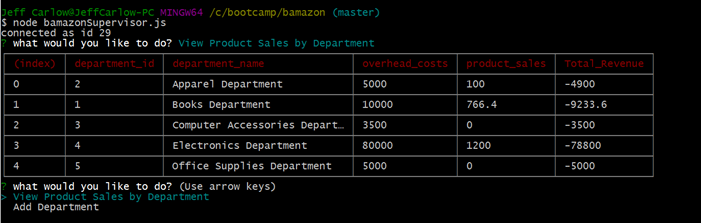
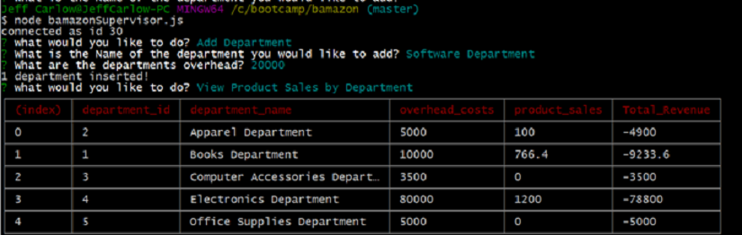

# IT Supplies Direct
Amazon-like application. This app uses node.js  to create a dynamic mysql datbase which creates and manages a storefront.

## Customer Use of Application

1.) open git terminal and navigate to the folder of the app. In the command line enter `node bamazonCustomer.js` . This will populate a table with all of the items available for sale.

2.) the terminal will then prompt the user to enter the `item_id` and `quantity` they wish to order. Once the order is complete a console.log will appear thanking the customer for their order, and give them a total for their order. This will also update the database in the `product_sales` column and `stock_qty` column.

2a.) the terminal will then prompt the user to enter the `item_id` and `quantity` they wish to order. If the user attempts to order more product than what is in stock a console.log will appear apolgozing for the fact not enough of the product is in stock, and the order will stop and will not complete.

## Manager Use of Application

1.) Open git terminal and navigate to the folder of the app. In the command line enter `node bamazonManager.js` . This will display options that are available for the manager. First select `View Products For Sale` . This will generate a report of all products in the database.

2.) The menu will re-populate after you run the `View Products for sale` prompt. Next select `View Low Inventory` from the menu. This will generate a report of all items that have stock levels of less than 3.

3.)The menu will re-populate again, and this time the manager will want to increase the inventory of certain items. Select `Add to Inventory` and another prompt will display. It will list all items in the database. Scroll down to the item that needs to have its inventory increased and click enter.

3a.) Another prompt will display asking what quantity of the product you wish to add. At this point a number is selected and enter is clicked. This will execute the increase in quantity of the product. A message will display alerting you what item was updated and for what quantity.

4.) The menu will re-populate again. This time the manager needs to add a product to the database. This is done by selecting `Add New Product`. This will generate another prompt which will ask questions about the product. This includes `Product Name`, `Department Name` , `price`, and ` stock quantity` . It will then display a message that the product was added!

## Supervisor Use of Application

1.) Open git terminal and navigate to the folder of the app. In the command line enter `node bamazonSupervisor.js` . This will display options that are available for the supervisor. First select `View Products Sales By Department` . This will generate a report of sales by department for the supervisor to review.

2.) The menu will re-populate with the available options. This time select `Add Department`. There will be another prompt where `department name` and `overhead cost` need to be entered. Once this is executed a message will display letting you know that the department was added.

# Technologies Used
* MYSQL
* Javascript
* NPM
* Node.js
